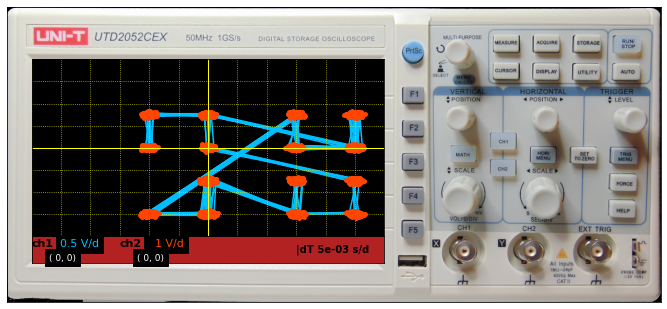
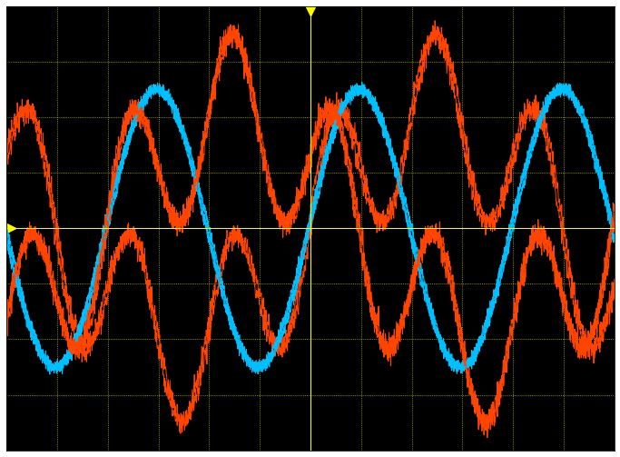

# Virtual Electro Labs
To simulate some ele related stuff.

Can be either copied into working dir or installed via
`python3 pyElab/setup.py install`

# Oscilloscope:
[oscilloscope notebook](Demo/OsciDemoMD/OsciDemo.md)
[oscilloscope notebook PDF](Demo/OsciDemo.pdf)

In order to show full device, copy the `lab_meta` folder (with the background pic) into your working directory.
Otherwise, only the shader is shown:

